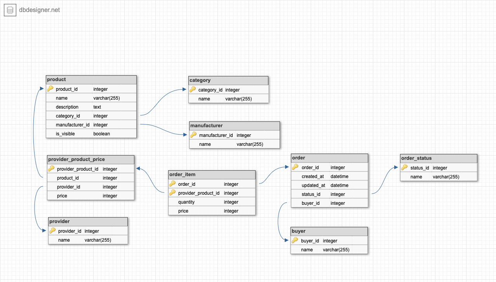

## Задание 2
### Задача
Добавляем в модель данных дополнительные индексы и ограничения

Цель:
Научиться применять индексы в реальном проекте
1. Проводим анализ возможных запросов\отчетов\поиска данных.
2. Предполагаем возможную кардинальность поля.
3. Создаем дополнительные индексы - простые или композитные.
4. На каждый индекс пишем краткое описание зачем он нужен (почему по этому полю\полям).
5. Думаем какие логические ограничения в БД нужно добавить - например какие поля должны быть уникальны, в какие нужно добавить условия, чтобы не нарушить бизнес логику. Пример - нельзя провести операцию по переводу средств на отрицательную сумму.
6. Создаем ограничения по выбранным полям. 

### Схема
Схема, спроектированная в первом задании:


### Анализ возможных запросов\отчетов\поиска данных
- отобразить на сайте список продуктов с категориями и ценами
- отобразить заказ в интерфейсе со всеми добавленными товарами
- показать итоговую цену заказа
- отдельной утилитой/скриптом добавить/обновить цены поставщика (например, из предоставленного csv файла)
- возможные варианты отчетов:
  - на какую сумму продано товаров по каждому поставщику
  - количество уникальных заказов содержащих товары поставщика
  - на какую сумму продано товаров по каждому производителю

### Индексы и ограничения
#### Первичные индексы
Первичные индексы уже отмечены на схеме. Они везде простые одноколоночные, за исключением таблицы *order_item*, где указан индекс составной - это сделано для ограничения с учетом бизнес логики: в одном заказе каждый продукт от поставщика должен быть уникальным.

#### Дополнительные индексы
В целях ограничений, предполагается создать составной уникальный индекс для таблицы *provider_product_price* по полям *product_id* и *provider_id*. Думаю, кардинальность выше будет у поля product_id, поэтому поставил его на первое место.

#### Логичеакие ограничения по таблицам
Скорее всего, по каждому полю очевидно для какой цели то, или иное ограничение.
Например, или поставщик не могут быть без имени. В то же время, продукт может быть без описания.
Также цена должна быть положительной и тд.

**poduct**
- name NOT NULL
- category_id NOT NULL
- manufaturer_id NOT NULL
- is_visible NOT NULL

**category**
- name NOT NULL

**manufacturer**
- name NOT NULL

**provider_product_price**
- product_id NOT NULL
- provider_id NOT NULL
- price NOT NULL, больше 0

**provider**
- name NOT NULL

**order_item**
- quentity NOT NULL, больше или равно 1
- price NOT NULL, больше 0

**order**
- create_at NOT NULL
- upate_at NOT NULL
- status_id NOT NULL
- buyer_id NOT NULL

**buyer_id**
- name NOT NULL

#### Внешние ключи
Все внешние связи показаны на схеме. Также они указаны в SQL ниже. Сами связи, думаю, также логичны и очевидны.
Все внешние ограничения ON DELETE RESTRICT. Каскадные операции здесь будут неуместны.

### SQL
Ниже приведен sql для создания каждой из таблиц.

```
CREATE TABLE product (
	product_id serial NOT NULL,
	name varchar(255) NOT NULL,
	description TEXT,
	category_id integer NOT NULL REFERENCES category ON DELETE RESTRICT,
	manufacturer_id integer NOT NULL REFERENCES manufacturer ON DELETE RESTRICT,
	is_visible BOOLEAN NOT NULL,
	CONSTRAINT product_pk PRIMARY KEY (product_id)
);

CREATE TABLE category (
	category_id serial NOT NULL,
	name varchar(255) NOT NULL,
	CONSTRAINT category_pk PRIMARY KEY (category_id)
);

CREATE TABLE provider (
	provider_id serial NOT NULL,
	name varchar(255) NOT NULL,
	CONSTRAINT provider_pk PRIMARY KEY (provider_id)
);

CREATE TABLE provider_product_price (
	provider_product_id serial NOT NULL,
	product_id integer NOT NULL REFERENCES product ON DELETE RESTRICT,
	provider_id integer NOT NULL REFERENCES provider ON DELETE RESTRICT,
	price integer NOT NULL CHECK (price > 0),
	CONSTRAINT provider_product_price_pk PRIMARY KEY (provider_product_id)
    UNIQUE(product_id, provider_id)
);

CREATE TABLE manufacturer (
	manufacturer_id serial NOT NULL,
	name varchar(255) NOT NULL,
	CONSTRAINT manufacturer_pk PRIMARY KEY (manufacturer_id)
);

CREATE TABLE buyer (
	buyer_id serial NOT NULL,
	name varchar(255) NOT NULL,
	CONSTRAINT buyer_pk PRIMARY KEY (buyer_id)
);

CREATE TABLE order (
	order_id serial NOT NULL,
	created_at DATETIME NOT NULL,
	updated_at DATETIME NOT NULL,
	status_id integer NOT NULL REFERENCES order_status ON DELETE RESTRICT,
	buyer_id integer NOT NULL REFERENCES buyer ON DELETE RESTRICT,
	CONSTRAINT order_pk PRIMARY KEY (order_id)
);

CREATE TABLE order_item (
	order_id integer NOT NULL REFERENCES order ON DELETE RESTRICT,
	provider_product_id integer NOT NULL REFERENCES provider_product_price ON DELETE RESTRICT,
	quantity integer NOT NULL CHECK (quantity >= 1),
	price integer NOT NULL CHECK (price > 0),
	CONSTRAINT order_item_pk PRIMARY KEY (order_id,provider_product_id)
);

CREATE TABLE order_status (
	status_id serial NOT NULL,
	name varchar(255) NOT NULL,
	CONSTRAINT "order_status_pk" PRIMARY KEY ("status_id")
);

```