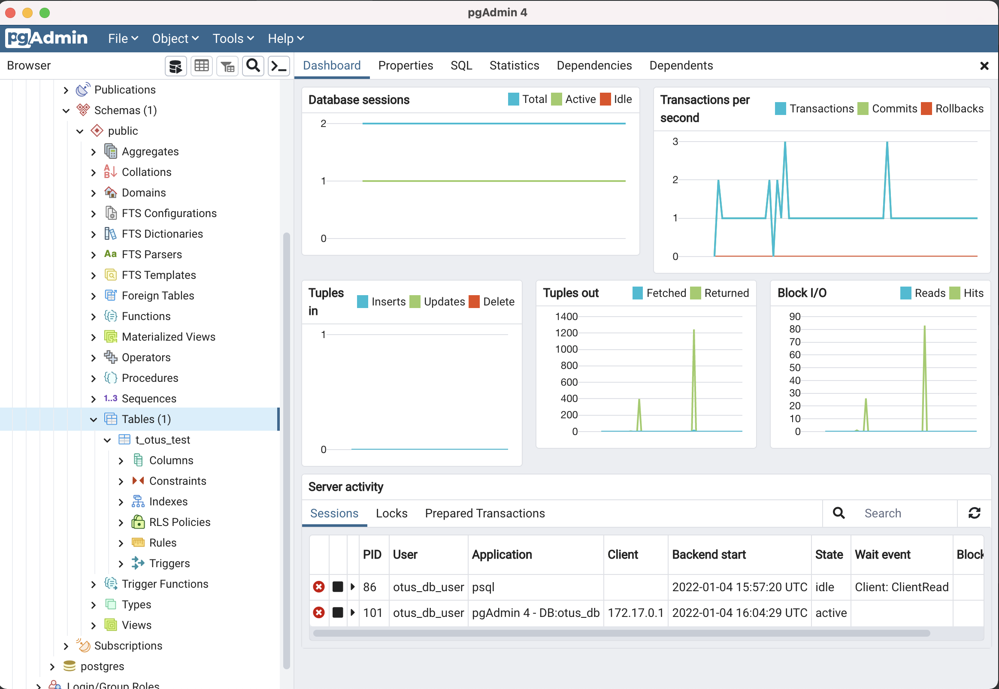

## Задание 3
### Задача
Создать кластер PostgreSQL в докере или на виртуальной машине, запустить сервер и подключить клиента

Развернуть контейнер с PostgreSQL или установить СУБД на виртуальную машину.
Запустить сервер.
Создать клиента с подключением к базе данных postgres через командную строку.
Подключиться к серверу используя pgAdmin или другое аналогичное приложение.

### Установка Postgres 14

```docker run -d \
        --name otus-db-postgres \
        -p 5432:5432 \
        -e POSTGRES_PASSWORD=db_pass \
        -e POSTGRES_USER=otus_db_user \
        -e POSTGRES_DB=otus_db \
         postgres:14-alpine
```

### Подключение
#### К контейнеру
```docker exec -it otus-db-postgres bash```

#### К БД
Для подключения выполним в консоли команду:
```
psql -U otus_db_user -d otus_db
```
Выведем список доступных БД:
```
otus_db=# \l
                                       List of databases
   Name    |    Owner     | Encoding |  Collate   |   Ctype    |       Access privileges
-----------+--------------+----------+------------+------------+-------------------------------
 otus_db   | otus_db_user | UTF8     | en_US.utf8 | en_US.utf8 |
 postgres  | otus_db_user | UTF8     | en_US.utf8 | en_US.utf8 |
 template0 | otus_db_user | UTF8     | en_US.utf8 | en_US.utf8 | =c/otus_db_user              +
           |              |          |            |            | otus_db_user=CTc/otus_db_user
 template1 | otus_db_user | UTF8     | en_US.utf8 | en_US.utf8 | =c/otus_db_user              +
           |              |          |            |            | otus_db_user=CTc/otus_db_user
(4 rows)
```
Создадим тестовую таблицу:
```
otus_db=# create table t_otus_test(a integer not null);
CREATE TABLE
otus_db=#
otus_db=# \dt;
              List of relations
 Schema |    Name     | Type  |    Owner
--------+-------------+-------+--------------
 public | t_otus_test | table | otus_db_user
(1 row)
```
Теперь подключимся к БД через pgAdmin. На скринщоте видно тестовую таблицу созданную через консольный клиент.
Также видны оба процесса, обслуживающие коннекты.



В коце остановим контейнер:
```
docker stop otus-db-postgres
```